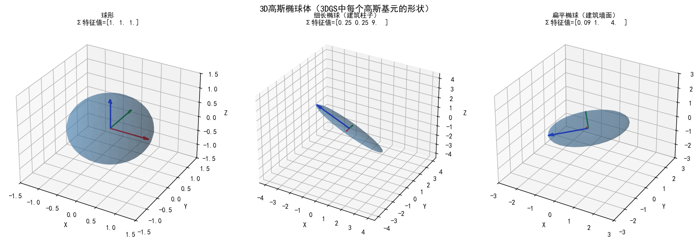
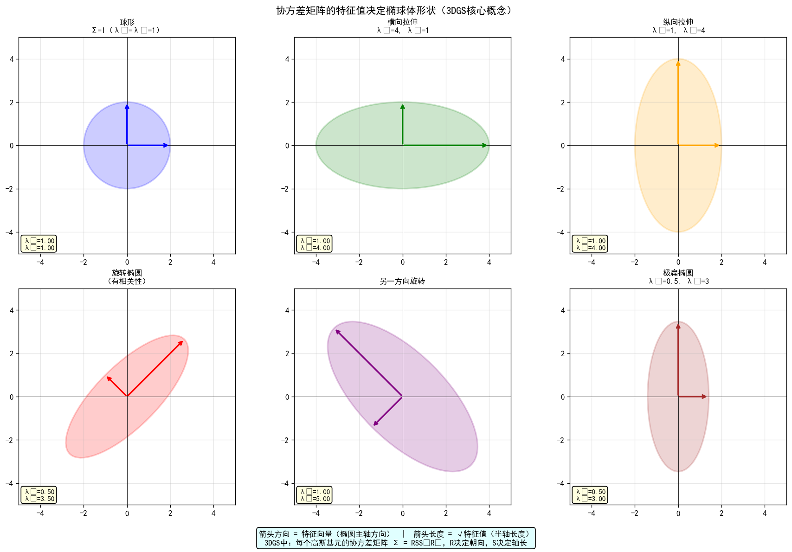
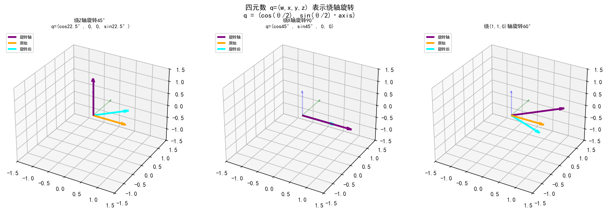
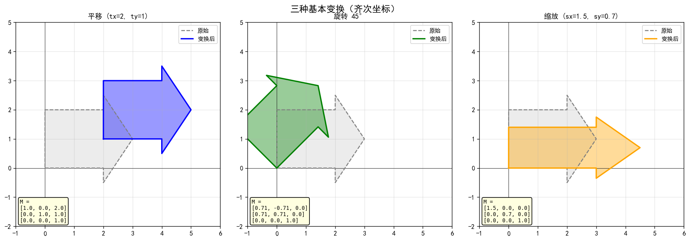
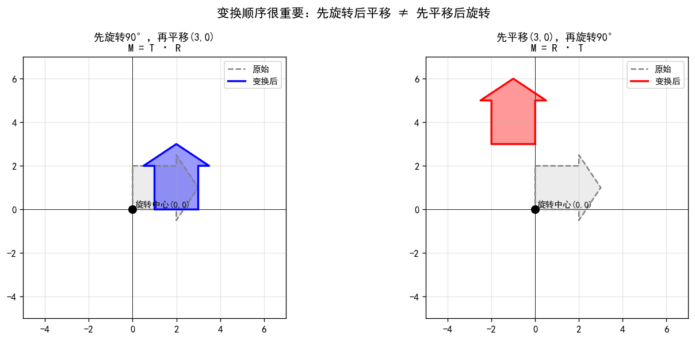
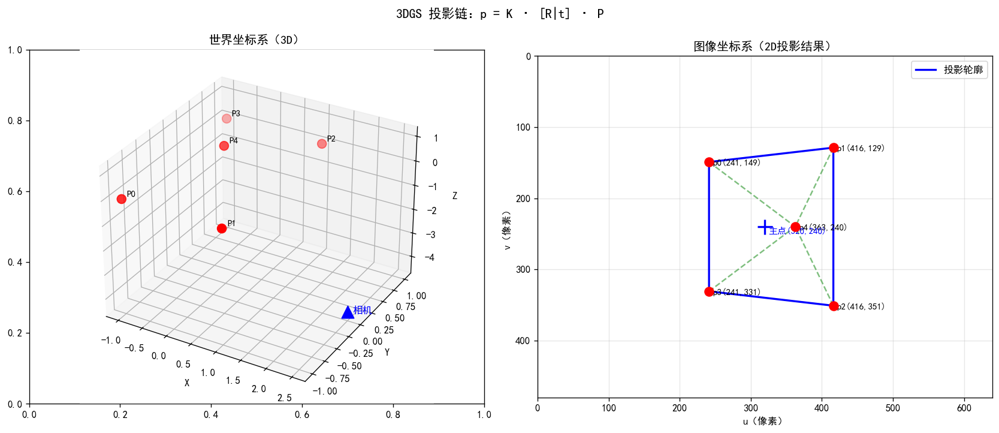

# gaussian-splash: 3D Gaussian Splatting Systematic Learning & Research 🚀

[](https://www.python.org/)
[](https://pytorch.org/)

本项目是我从零开始，系统性学习并研究 **3D Gaussian Splatting (3DGS)** 的完整科研记录。项目旨在通过“理论推导 -> 手写代码验证 -> SOTA论文复现 -> 垂直场景改进”的闭环，建立扎实的辐射场渲染与三维重建能力，特别关注 **3DGS 在建筑场景与数字化测绘** 中的应用。

---
## 📂 仓库架构说明 (Repository Structure)

**本仓库严格遵循渐进式的学术研究路径进行组织**：

```text
gaussian-splash/
├── 00_papers/                  # 经典及前沿 3DGS 相关论文清单与阅读笔记
├── 01_foundation_phase/        # Phase 1: 基础夯实阶段（1-8周）
│   ├── demo/                   # 各周次数学与图形学底层原理的手写验证代码
│   ├── notes/                  # 详细的学习指南、公式推导及练习题 (Markdown)
│   └── src/                    # 抽象出的基础通用工具库
├── 02_core_implementation/     # Phase 2: 核心复现阶段（9-16周）
│   └── ...                     
├── 03_optimization_expansion/  # Phase 3: 前沿进阶与建筑场景优化（17-24周）
│   └── ...                     
├── .gitignore                  # 忽略临时文件、缓存及大型数据集
├── requirements.txt            # 项目依赖环境
└── README.md                   # 本说明文件
```
---
## 🖼️ 核心原理可视化展示 (Core Principle Visualizations)

*以下结果由 `01_foundation_phase/demo/` 下的脚本运行生成。*

### 1. 线性代数与几何变换 (Week 1-2)
本模块通过代码复现了高斯基元的形状参数化逻辑。

| 3D 高斯椭球体参数化 ($\Sigma$) | 特征值、特征向量与椭圆形状 | 四元数旋转变换 (Quaternion) |
| :---: | :---: | :---: |
|  |  |  |
| **核心逻辑**：将 $S$ 与 $R$ 矩阵组合成物理意义明确的协方差矩阵 | **核心逻辑**：特征值大小决定了椭球在主轴方向的缩放程度 | **核心逻辑**：使用四元数避免万向锁，实现平滑的 3D 旋转优化 |

### 2. 坐标变换与投影链路
理解从世界坐标系到图像平面的投影过程，是实现可微分渲染的基础。

| 基础几何变换 (TRS) | 变换复合顺序对比 | 相机投影链模拟 |
| :---: | :---: | :---: |
|  |  |  |
| 平移、旋转与缩放的矩阵表示 | 验证矩阵乘法不可交换性对渲染的影响 | 模拟点云在不同相机位姿下的投影结果 |

---
## 🛠️ 环境配置 (Environment Setup)
1. 克隆本仓库并进入目录。
2. 创建并激活 Conda 环境：
```python
conda create -n 3dgs-study python=3.9
conda activate 3dgs-study
```
3. 安装依赖
```python
pip install -r requirements.txt
```
4. 运行任意模块的 Demo（以 Week 1 为例）：
```python
cd 01_foundation_phase/demo/1-2week_线性代数
python demo_01_向量与矩阵基础.py
```

## 📧 声明：本项目文件与代码严格用于个人学术能力的提升与硕士研究生复试准备。

